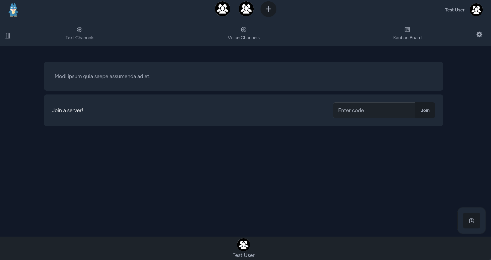
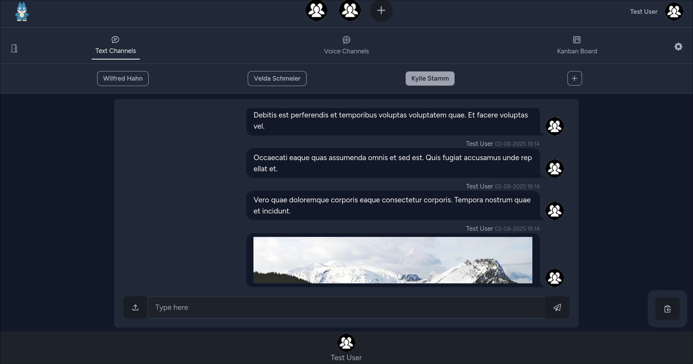
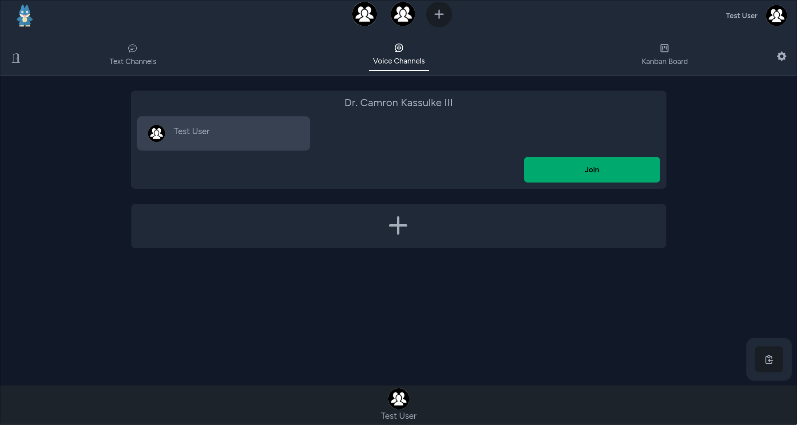
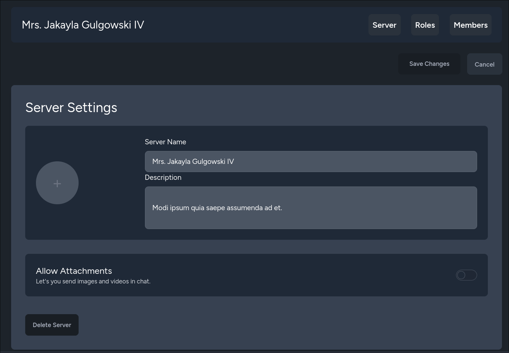

# Oxy

A modern, real-time social team collaboration platform designed for seamless communication, organization, and creative brainstorming. Oxy brings together chat, voice, collaborative whiteboards, and granular team management into a fast, reactive single-page experience.


---

## ✨ Features

- **💬 Real-Time Chat & Rich Media**: Instant messaging powered by Laravel Reverb WebSockets. Supports rich message attachments (images, audio, video, documents, code), recent uploads history, inline media previews, and an integrated image editor (crop, rotate, and flip).
- **🎨 Synchronized Whiteboards**: Multi-user real-time collaborative canvas powered by **Konva** and **Yjs** (CRDT synchronization with conflict-free merging, offline saving, and export).
- **🎙️ Voice Channels**: Real-time voice rooms with presence tracking and deterministic state machine transitions.
- **🎛️ Modular Multi-Pane Layout**: Draggable and resizable split panes with gutter drag controls, pane swapping, and full-screen maximization modes.
- **🛡️ Team Roles & Granular Permissions**: Role-Based Access Control (RBAC) backed by **Spatie Laravel Permission**, customizable role colors, and fine-grained server-level permissions.
- **🔗 Anti-Scraping Server Invites**: High-entropy 128-bit Base64-URL invite tokens with configurable usage caps, expiration dates, and anti-abuse rate limiting.
- **🟢 User Presence Tracking**: Live user status tracking (Online, Idle, Do Not Disturb, Invisible, Offline) enforced by backend and frontend state machines.
- **🌗 Dual-Theme Customization**: Independent light and dark theme selection powered by DaisyUI, custom profile avatars, "About Me" bios, and downloadable PDF profile summaries.
- **🌐 Internationalization (i18n)**: Multi-language support (English and Latvian).

---

## 📸 Screenshots

| Feature | Preview |
| :--- | :--- |
| **Server Overview** |  |
| **Real-Time Chat** |  |
| **Voice Channels** |  |
| **Server & Role Settings** |  |

---

## 🛠️ Technology Stack

Oxy is built on a modern **VILT** (Vue, Inertia, Laravel, Tailwind) stack with real-time and CRDT capabilities:

### Backend
- **[Laravel 12](https://laravel.com/)**: PHP 8.5+ enterprise framework powering the core API, authentication, and queues.
- **[Laravel Octane & FrankenPHP](https://frankenphp.dev/)**: High-performance application server with worker mode execution.
- **[Laravel Reverb](https://laravel.com/docs/reverb)**: Blazing-fast first-party WebSocket broadcasting server.
- **[Spatie Laravel Permission](https://spatie.be/docs/laravel-permission)**: Flexible team role and permission management.
- **[Intervention Image](https://image.intervention.io/) & [DomPDF](https://github.com/barryvdh/laravel-dompdf)**: Media processing and PDF report generation.

### Frontend
- **[Vue 3](https://vuejs.org/)**: Modern reactive single-page frontend using the Composition API (`<script setup>`) and TypeScript.
- **[Inertia.js 3](https://inertiajs.com/)**: Monolithic routing and state synchronization without separate REST APIs.
- **[Tailwind CSS v4](https://tailwindcss.com/) & [DaisyUI 5](https://daisyui.com/)**: Utility-first CSS framework and extensive component theming.
- **[Yjs](https://yjs.dev/) & [y-websocket](https://github.com/yjs/y-websocket)**: High-performance CRDT framework for conflict-free whiteboard collaboration.
- **[Konva (vue-konva)](https://konvajs.org/)**: 2D HTML5 canvas library for reactive, multi-layer whiteboard rendering.

---

## 🚀 Getting Started

### Option 1: Nix & devenv (Recommended for Nix users)

This project provides a fully automated developer environment via [devenv.sh](https://devenv.sh). It bundles PHP 8.5, Node.js 24, pnpm, and SQLite, and starts all background workers simultaneously.

1. Ensure [Nix](https://nixos.org/) and `devenv` are installed on your machine.
2. Enter the development shell:
   ```bash
   devenv shell
   ```
3. Set up the environment and database:
   ```bash
   cp .env.example .env
   composer install
   pnpm install
   php artisan key:generate
   php artisan migrate
   php artisan storage:link
   ```
4. Start all services (Vite, Yjs server, Laravel serve, Queue worker, Reverb WebSockets) concurrently:
   ```bash
   devenv up
   ```

---

### Option 2: Docker Compose (Recommended for Containerized Deployments)

Run the full container stack (FrankenPHP server, Laravel Octane, Reverb, Queue worker, and Yjs collaboration server):

1. Copy the environment configuration:
   ```bash
   cp .env.example .env
   ```
2. Build and launch containers:
   ```bash
   docker compose up --build
   ```
3. Access the web interface at `http://localhost:8000` (and WebSocket server at port `9000` / Yjs at `1234`).

---

### Option 3: Manual Local Setup

If you prefer installing dependencies locally:

#### Prerequisites
- PHP 8.5+ with `pdo`, `sqlite` / `pdo_mysql`, `pcntl`, and `zip` extensions
- Composer
- Node.js 24+ & pnpm (or npm)
- SQLite or MySQL / MariaDB

#### Installation Steps
1. Install backend and frontend dependencies:
   ```bash
   composer install
   pnpm install
   ```
2. Configure environment:
   ```bash
   cp .env.example .env
   php artisan key:generate
   ```
3. Initialize the database and storage:
   ```bash
   php artisan migrate
   php artisan storage:link
   ```
4. Run the development services in separate terminals (or with a process runner):
   ```bash
   # Terminal 1: HTTP application server
   php artisan serve

   # Terminal 2: Vite asset dev server
   pnpm run dev

   # Terminal 3: Laravel Reverb WebSocket server
   php artisan reverb:start

   # Terminal 4: Background queue worker
   php artisan queue:work

   # Terminal 5: Yjs collaboration WebSocket server
   pnpm run yjs
   ```

---

## 🧪 Testing & Code Quality

Run the automated test suites and linters:

```bash
# Run backend Pest feature & unit tests
php artisan test

# Run frontend Vitest suite
pnpm run test

# Run Laravel Pint code formatter
php artisan pint
```

---

## 📖 Architecture & Documentation

Comprehensive technical documentation, state machine specifications, and system references are available in the [`docs/`](docs/) directory:

- [Architectural Reference Overview](docs/index.md)
- [Authentication & User System](docs/architecture/authentication.md)
- [Server Invites & Anti-Scraping System](docs/architecture/invites.md)
- [Permissions & Team Roles System](docs/architecture/permissions.md)
- [Real-Time WebSockets & Broadcasting Architecture](docs/architecture/broadcasting.md)
- [State Machines Reference](docs/state-machines/domain-entities.md)

---

## 📄 License

This project is open-source software licensed under the [MIT License](LICENSE).