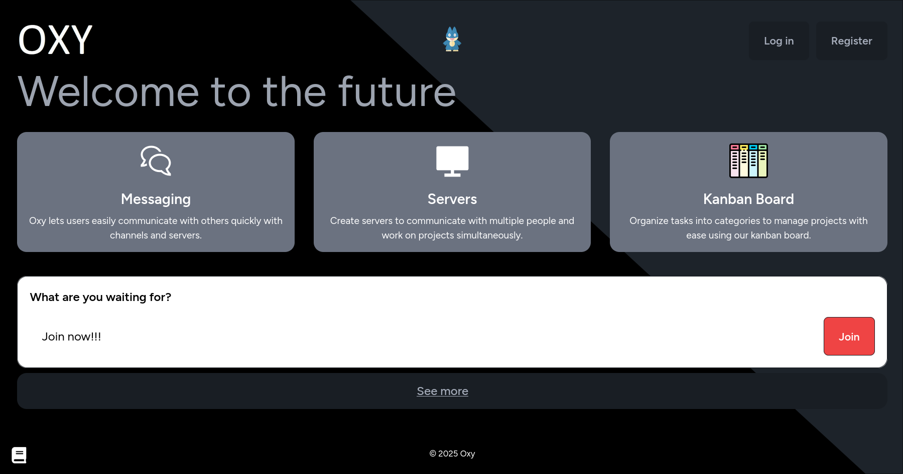

# Oxy

A modern, real-time team collaboration platform built with **Vue 3 SPA**, **PocketBase**, **LiveKit WebRTC SFU**, and **Yjs CRDT Whiteboards**. Oxy brings together instant chat, high-performance voice/video rooms, collaborative whiteboards, and granular team management into a lightweight, decoupled single-page application.



---

## ✨ Features

- **💬 Real-Time Chat & S3 Media Attachments**: Instant messaging powered by PocketBase Realtime SSE. Supports file attachments directly uploaded to PocketBase / S3 storage.
- **🎙️ LiveKit Voice, Video & Screen Share**: High-capacity WebRTC audio/video calls, camera feeds, and screen sharing powered by LiveKit SFU.
- **🎨 Synchronized Whiteboards**: Multi-user real-time collaborative canvas powered by **Konva** and **Yjs** (CRDT synchronization with conflict-free merging, offline saving, and JSON snapshots stored in PocketBase).
- **🎛️ Modular Multi-Pane Layout**: Draggable and resizable split panes with gutter drag controls, pane swapping, and full-screen maximization modes.
- **🛡️ Team Roles & Granular Permissions**: Role-Based Access Control (RBAC) backed by PocketBase API rules and custom TypeScript server hooks.
- **🔗 High-Entropy Server Invites**: 128-bit Base64-URL invite tokens with usage limits and expiration checks validated via PocketBase hooks.
- **🟢 User Presence Tracking**: Live user status tracking (Online, Idle, Do Not Disturb, Invisible, Offline) powered by PocketBase SSE.
- **📱 Multi-Platform Deployment**: Single Vue 3 SPA core deployable to Web, Desktop (Electron), and Mobile (Capacitor iOS/Android).

---

## 🛠️ Technology Stack

Oxy is built on a decoupled, ultra-lightweight architecture:

### Backend
- **[PocketBase](https://pocketbase.io/)**: Single Go binary (~30MB) providing SQLite DB (WAL mode), Auth (Email, OAuth2), file storage, and real-time SSE subscriptions.
- **[LiveKit SFU](https://livekit.io/)**: High-performance Go SFU server for multi-user WebRTC audio, video, and screen sharing.
- **TypeScript Server Hooks (`src/hooks/*.ts` -> `pb_hooks/`)**: Transpiled server-side hooks for invite validation, LiveKit JWT token signing, and custom API endpoints.

### Frontend
- **[Vue 3](https://vuejs.org/)**: Modern reactive single-page app (`<script setup>`) with **Vue Router 4** and TypeScript.
- **[Tailwind CSS v4](https://tailwindcss.com/) & [DaisyUI 5](https://daisyui.com/)**: Utility-first styling and theme engine.
- **[Yjs](https://yjs.dev/) & [y-websocket](https://github.com/yjs/y-websocket)**: High-performance CRDT framework for whiteboard collaboration.
- **[Konva (vue-konva)](https://konvajs.org/)**: HTML5 2D canvas rendering engine.

---

## 🚀 Getting Started

### Option 1: Nix & devenv (Recommended for Local Dev)

The project provides a Nix development environment via `devenv.nix`:

1. Enter the development shell:
   ```bash
   devenv shell
   ```
2. Install dependencies:
   ```bash
   pnpm install
   ```
3. Start PocketBase and Vite dev servers:
   ```bash
   devenv up
   ```

---

### Option 2: Docker Compose (Single Container Stack)

Build and launch PocketBase (carrying the static SPA and TS hooks), LiveKit SFU, and Yjs helper:

```bash
docker compose up --build
```
Access the application at `http://localhost:8090` (and LiveKit at `http://localhost:7880`).

---

### Option 3: Deploy with Uncloud

Deploy to an Uncloud cluster using `compose.uncloud.yaml`:

```bash
uc deploy -f compose.uncloud.yaml
```

---

## 🧪 Testing & Code Quality

Run automated TypeScript hook compilation and Vitest test suite:

```bash
# Compile TypeScript hooks to pb_hooks/
pnpm run build:hooks

# Run Vitest suite
pnpm run test

# Build production SPA & hooks
pnpm run build
```

---

## 📄 License

This project is open-source software licensed under the [MIT License](LICENSE).
