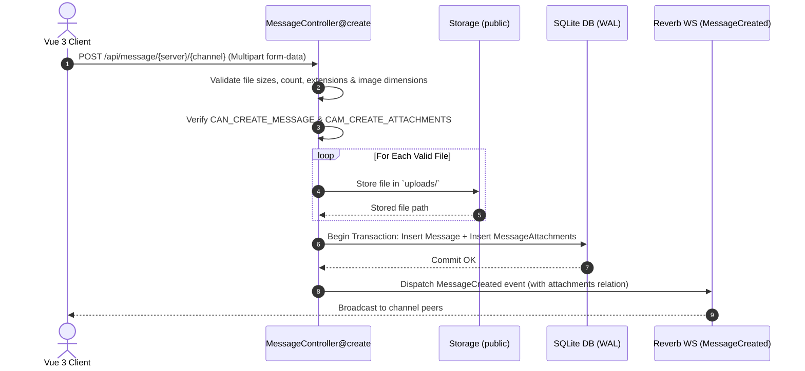

# Message Attachments & Upload Architecture

This document outlines the architecture, data models, security controls, and client-side processing for message attachments in Oxy.

---

## 1. Overview & Goals

Oxy provides a rich, multi-file attachment pipeline integrated directly into channel messaging:

1. **Rich Media Support**: Native support and inline rendering for images, audio, video, code files, and documents.
2. **Security-First Validation**: Dual-layer (client-side pre-flight and backend server-side) validation preventing blocked executable scripts, oversized payloads, and memory exhaustion.
3. **Transactional Integrity**: Database transaction guarantees message creation and attachment records are atomically written.
4. **Client Pre-Processing**: Interactive in-browser image adjustments (cropping, rotating, flipping) via HTML5 Canvas before uploading.
5. **Storage Cleanup Cascades**: Model event hooks (`static::deleted`) automatically remove physical files from the storage disk when messages or attachments are deleted.

---

## 2. Database Schema & Model Design

### Table Schema (`message_attachments`)

| Column | Type | Attributes | Description |
| :--- | :--- | :--- | :--- |
| `id` | UUID | Primary Key | Unique identifier for attachment |
| `message_id` | UUID | Foreign Key (`messages.id`) | Cascade-deleted parent message |
| `filename` | String | Not Null | Original sanitized filename |
| `path` | String | Not Null | Storage path relative to public disk (e.g. `uploads/...`) |
| `mime_type` | String | Nullable | Detected MIME type (e.g. `image/png`, `video/mp4`) |
| `size` | BigInteger | Unsigned | File size in bytes |
| `width` | Integer | Nullable | Image width in pixels (for image types) |
| `height` | Integer | Nullable | Image height in pixels (for image types) |
| `created_at` / `updated_at` | Timestamps | System | Timestamps |

### Model Implementation (`App\Models\MessageAttachment`)

```php
namespace App\Models;

use Illuminate\Database\Eloquent\Concerns\HasUuids;
use Illuminate\Database\Eloquent\Factories\HasFactory;
use Illuminate\Database\Eloquent\Model;
use Illuminate\Database\Eloquent\Relations\BelongsTo;
use Illuminate\Support\Facades\Storage;

class MessageAttachment extends Model
{
    use HasFactory, HasUuids;

    protected $fillable = [
        'message_id',
        'filename',
        'path',
        'mime_type',
        'size',
        'width',
        'height',
    ];

    protected $appends = ['url'];

    protected function casts(): array
    {
        return [
            'size' => 'integer',
            'width' => 'integer',
            'height' => 'integer',
        ];
    }

    public function message(): BelongsTo
    {
        return $this->belongsTo(Message::class);
    }

    public function getUrlAttribute(): string
    {
        return Storage::disk('public')->url($this->path);
    }

    protected static function booted(): void
    {
        static::deleted(function (MessageAttachment $attachment) {
            if ($attachment->path && Storage::disk('public')->exists($attachment->path)) {
                Storage::disk('public')->delete($attachment->path);
            }
        });
    }
}
```

---

## 3. Validation & Security Guardrails

Both client-side utilities (`resources/js/utils/fileValidation.ts`) and backend controller logic (`MessageController@create`) enforce strict upload constraints:

### Constraints & Configuration Matrix

| Rule | Default Limit | Configuration Key | Error Trigger |
| :--- | :--- | :--- | :--- |
| **Max File Size** | 25 MB (`25600 KB`) | `uploads.max_file_size` | File exceeds single upload cap |
| **Max Total Payload** | 100 MB (`102400 KB`)| `uploads.max_total_size` | Cumulative batch size exceeds limit |
| **Max Attachments** | 10 files | `uploads.max_attachments_per_message` | More than 10 files attached to 1 message |
| **Max Message Length**| 2,000 characters | `uploads.max_message_length` | Message string exceeds max characters |
| **Max Image Resolution**| 4096 × 4096 px | `uploads.max_image_width` / `height` | Image dimensions exceed limit |

### Blocked Script Extensions

To protect against arbitrary script execution and server compromise, the following file extensions are strictly blocked:

```php
'blocked_extensions' => [
    'php', 'phtml', 'php3', 'php4', 'php5', 'phps', 'phar',
    'cgi', 'pl', 'asp', 'aspx', 'jsp', 'sh', 'bash', 'zsh', 'cmd', 'ps1',
]
```

### Permission Guard

Sending messages with attachments requires the `CAM_CREATE_ATTACHMENTS` permission in addition to `CAN_CREATE_MESSAGE` within the active server team context:

```php
setPermissionsTeamId($channel->server_id);
$user = Auth::user();

if ($hasContent && ! $user->hasPermissionTo('CAN_CREATE_MESSAGE')) {
    abort(403, 'You do not have permission to send messages in this server.');
}

if ($hasAttachments && ! $user->hasPermissionTo('CAM_CREATE_ATTACHMENTS')) {
    abort(403, 'You do not have permission to attach files in this server.');
}
```

---

## 4. Message Creation & Upload Workflow



---

## 5. Frontend Components & Client Processing

### 1. File Validation Composable (`fileValidation.ts`)
- Pre-flight batch validator `validateFilesBatch(currentFiles, newFiles)` prevents invalid uploads before network dispatch.
- Returns detailed errors for blocked extensions, duplicate files, and size threshold breaches.

### 2. Recent Uploads Memory (`useRecentUploads.ts`)
- Keeps an in-memory & local session history of recently uploaded files.
- Provides `RecentUploadsDropdown.vue` for rapid re-attachment of frequent files without navigating local folders.

### 3. Integrated Image Editor (`ImageEditorModal.vue`)
- Built-in canvas image transform tool allowing users to crop, rotate (90° steps), and horizontally/vertically flip images prior to submission.
- Replaces raw `File` objects with processed `Blob` payloads before upload dispatch.

### 4. Media Renderers
- **`FilePreviewCard.vue`**: Renders staged attachments in the chat composer bar with remove & edit actions.
- **`FileAttachmentDisplay.vue`**: Handles inline media playback and viewing in chat streams (audio players, video elements, full-screen lightbox for images, syntax-highlighted code files, and download cards).
