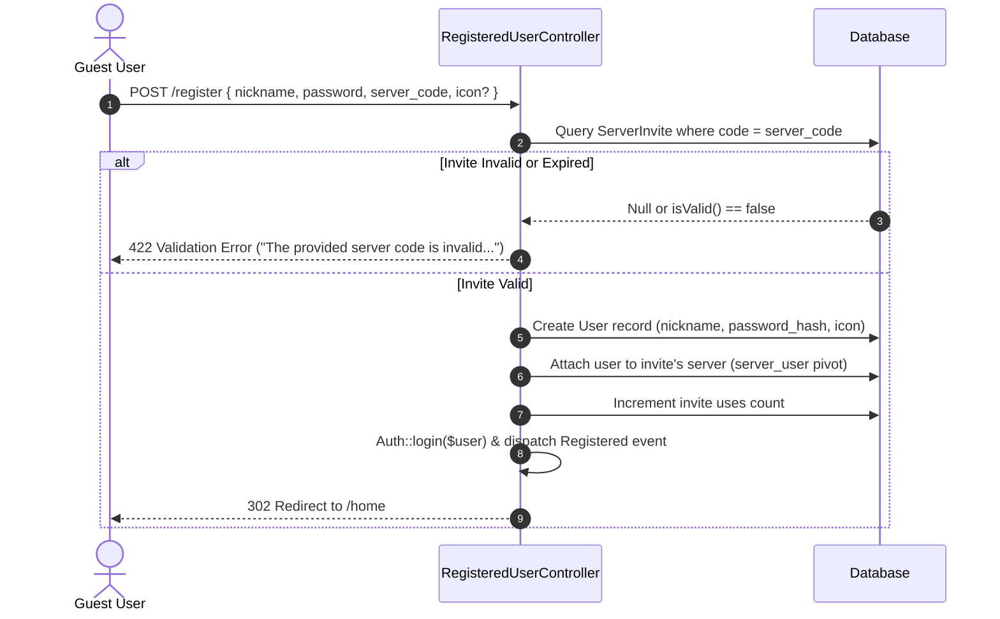

# Authentication & User System Architecture

This document covers user registration, authentication, session security, and profile handling in Oxy.

---

## 1. Overview & Auth Strategy

Oxy provides a streamlined authentication system designed for team collaboration platform access:

- **Primary Identifier**: Unique `nickname` (instead of traditional email requirements for quick onboarding).
- **Password Security**: Hashed using `Bcrypt` via `Hash::make()`.
- **Registration Safeguard**: Mandatory validation of a valid `server_code` upon registration to prevent open spam registration.
- **Session Management**: Web session cookies (`web` guard) with CSRF protection and Laravel Sanctum API authentication.

---

## 2. Registration Workflow (`RegisteredUserController`)

---

## 3. Session Security & Rate Limiting

1. **Authentication Rate Limiting**:
   - `POST /login` is throttled by `LoginRequest` using key `throttleKey()` (`Str::transliterate(Str::lower($this->input('nickname'))).'|'.$this->ip()`).
   - Max 5 failed attempts per minute before lockouts occur.

2. **Invite & Registration Protection**:
   - `POST /register`, `POST /invites/join`, and `POST /api/server/add-user` are protected by `throttle:10,1` middleware (10 requests per minute per IP) to mitigate brute-force enumeration.

---

## 4. User Profile & Export

- **Profile Customization**: Users can update their nickname, "About Me" bio, presence status, upload a custom profile avatar/icon (validated to max 1920 × 1080 dimensions and 2MB file size), and configure independent light and dark theme preferences (`light_theme` and `dark_theme` from DaisyUI themes).
- **Data Export**: `PDFExportController@exportPDF` provides a downloadable PDF summary of the user's profile and active server memberships. See [Theming & PDF Data Export Architecture](theming-and-export.md).
