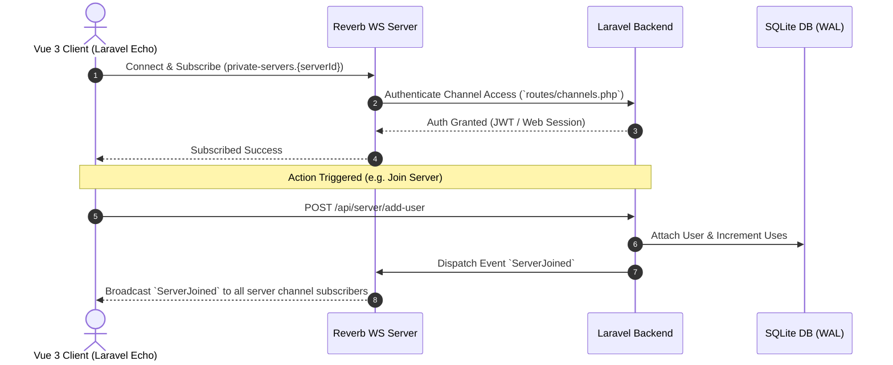

# Real-Time WebSockets & Broadcasting Architecture

This document covers Oxy's real-time event-driven architecture using **Laravel Reverb**, **Laravel Echo**, and WebSocket channels.

---

## 1. Overview & Connection Lifecycle

Oxy relies on real-time bidirectional WebSocket communication for chat messages, user presence, voice call coordination, whiteboard updates, and server membership changes.

- **WebSocket Engine**: [Laravel Reverb](https://laravel.com/docs/reverb) (high-performance WebSocket server for Laravel).
- **Client Frontend**: Laravel Echo (`resources/js/bootstrap.ts`) configured with Pusher JS protocol client.
- **Concurrency**: Processed alongside HTTP requests using SQLite WAL mode for non-blocking concurrent writes.



---

## 2. Channel Architecture & Security (`routes/channels.php`)

All real-time channels in Oxy leverage Laravel **Implicit Model Binding** (`Server $server`, `Channel $channel`, `User $user`) to automatically resolve Eloquent model instances from UUID parameters in channel names:

```php
Broadcast::channel('servers.{server}', function (User $user, Server $server): bool {
    return $user->servers->contains('id', $server->id);
});

Broadcast::channel('messages.{channel}', function (User $user, Channel $channel): bool {
    return $channel->server->users->contains('id', $user->id);
});
```

*Note: Over the WebSocket wire, Laravel Echo automatically prepends `private-` or `presence-` (e.g., `private-servers.{serverId}`).*

| Channel Name Pattern | Channel Type | Parameter Binding | Authorization Rule |
| :--- | :--- | :--- | :--- |
| `servers.{serverId}` | Private | `string $serverId` | User is a member of `$serverId` |
| `channels.{serverId}` | Private | `string $serverId` | User is a member of `$serverId` |
| `roles.{serverId}` | Private | `string $serverId` | User is a member of `$serverId` |
| `messages.{channelId}` | Private | `string $channelId` | User is a member of `$channel->server_id` |
| `whiteboards.{channelId}` | Private | `string $channelId` | User is a member of `$channel->server_id` |
| `voices.{channelId}` | Presence | `string $channelId` | User is a member of `$channel->server_id` (Returns user payload) |
| `presence` | Presence | Authenticated `User` | Authenticated user presence pool |

---

## 3. Registered Broadcast Events

| Event Class | Channel Target | Payload | Description |
| :--- | :--- | :--- | :--- |
| `App\Events\Servers\ServerJoined` | `servers.{serverId}` | `userId`, `serverId` | Member joined server |
| `App\Events\Servers\ServerLeft` | `servers.{serverId}` | `userId`, `serverId` | Member left server |
| `App\Events\Servers\ServerEdited` | `servers.{serverId}` | `serverId`, `name`, `description`, `icon` | Server profile updated |
| `App\Events\Messages\MessageCreated` | `messages.{channelId}` | `Message` model with `user` and `attachments` | New chat message |
| `App\Events\Messages\MessageEdited` | `messages.{channelId}` | `Message` model | Message content edited |
| `App\Events\Messages\MessageDeleted` | `messages.{channelId}` | `Message` model | Message deleted |
| `App\Events\Users\UserStatusUpdated` | `presence` & `servers.{serverId}` | `user`, `old_status`, `new_status` | Presence status change |
| `App\Events\Whiteboards\WhiteboardStateUpdated` | `whiteboards.{channelId}` | `Whiteboard` model | Canvas CRDT state sync |

---

## 4. Client Subscriptions (`useServerEvents`)

Vue 3 composables automate Echo listener registration and cleanup on component lifecycle:

```ts
import { useServerEvents } from '@/composables/useServerEvents';

// Automatically subscribes to server channel and syncs store state
useServerEvents(selectedServerId);
```
