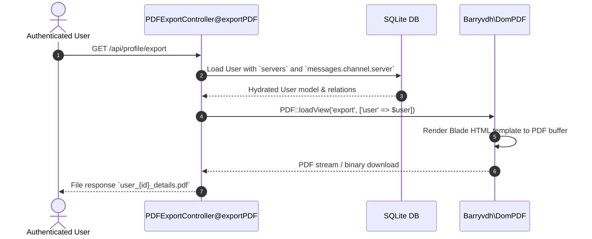

# Theming & PDF Data Export Architecture

This document covers Oxy's dual-theme configuration system and user data export pipeline.

---

## 1. Dual-Theme Architecture

Oxy allows users to configure independent theme preferences for light and dark color schemes, powered by **DaisyUI** and Tailwind CSS.

### Theme Storage & Enums

- **Model Fields**: `users.light_theme` and `users.dark_theme`.
- **Enum Definition**: `App\Enums\Theme` backing all supported DaisyUI palettes (`Oxy`, `Light`, `Dark`, `Cupcake`, `Bumblebee`, `Emerald`, `Corporate`, `Synthwave`, `Retro`, `Cyberpunk`, `Valentine`, `Halloween`, `Garden`, `Forest`, `Aqua`, `Lofi`, `Pastel`, `Fantasy`, `Wireframe`, `Black`, `Luxury`, `Dracula`, `Cmyk`, `Autumn`, `Business`, `Acid`, `Lemonade`, `Night`, `Coffee`, `Winter`, `Dim`, `Nord`, `Sunset`).
- **Dynamic Application**: Client theme switcher listens to system color scheme (`prefers-color-scheme`) and applies either `light_theme` or `dark_theme` to the root HTML `data-theme` attribute.

```php
use App\Enums\Theme;

protected function casts(): array
{
    return [
        'light_theme' => Theme::class,
        'dark_theme' => Theme::class,
    ];
}
```

---

## 2. PDF Data Export Architecture

Oxy provides an automated data export utility enabling users to generate and download a comprehensive PDF report of their account details, joined servers, and message histories via [barryvdh/laravel-dompdf](https://github.com/barryvdh/laravel-dompdf).

### Export Pipeline



---

## 3. PDF Template Layout & Structure

The PDF template (`resources/views/export.blade.php`) is designed with a clean, print-ready document structure:

### Document Hierarchy

```
┌──────────────────────────────────────────────────────────┐
│                      HEADER SECTION                      │
│        Title: "Exported Data"                            │
│        Subtitle: Generated for {User} on {Timestamp}     │
├──────────────────────────────────────────────────────────┤
│                   1. USER DETAILS CARD                   │
│   ┌───────────────┬──────────────────────────────────┐   │
│   │ Name          │ User Display Name                │   │
│   │ Icon URL      │ Absolute avatar asset URL / None │   │
│   │ Email         │ User email address               │   │
│   │ Created At    │ Account creation timestamp       │   │
│   └───────────────┴──────────────────────────────────┘   │
├──────────────────────────────────────────────────────────┤
│                  2. SERVER DETAILS CARDS                 │
│   (Repeated card per joined server)                      │
│   ┌───────────────┬──────────────────────────────────┐   │
│   │ Name          │ Server Name                      │   │
│   │ Icon URL      │ Server icon asset URL / None     │   │
│   │ Description   │ Server description text          │   │
│   │ Created At    │ Server creation date             │   │
│   └───────────────┴──────────────────────────────────┘   │
├──────────────────────────────────────────────────────────┤
│                 3. MESSAGE DETAILS CARDS                 │
│   (Repeated card per user message)                       │
│   ┌───────────────┬──────────────────────────────────┐   │
│   │ In Server     │ Target Server Name               │   │
│   │ Content       │ Message text / None              │   │
│   │ Attachments   │ Comma-separated filenames / None │   │
│   │ Created At    │ Message sent timestamp           │   │
│   └───────────────┴──────────────────────────────────┘   │
└──────────────────────────────────────────────────────────┘
```

### Layout Styling Rules

1. **Root Container**: Centered 800px max-width wrapper with system font stack (`-apple-system, BlinkMacSystemFont, "Segoe UI", Roboto, Helvetica, Arial, sans-serif`).
2. **Card & Section Elevation**: White background boxes (`#ffffff`) on light grey canvas (`#f3f4f6`) with subtle border lines (`#e5e7eb`).
3. **Table Column Allocation**: 30% fixed-width left column for metadata labels (uppercase `0.875rem` font, `#6b7280` text color) and 70% fluid right column for content values.
4. **Text Breaking**: `word-break: break-word` applied to prevent wide message bodies or URL links from overflowing table bounds.
5. **Empty State Fallbacks**: Graceful empty notices rendered when servers or messages collections contain zero items.
