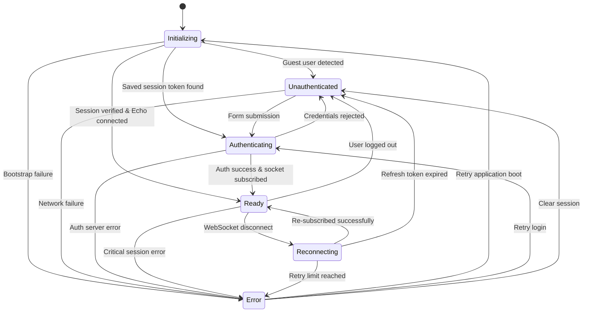

# Application Lifecycle State Machine

The **Application Lifecycle State Machine** tracks application startup, session authentication, and Laravel Echo WebSocket connection states.

---

## State Transition Diagram



---

## Vue 3 Composable (`useApplicationStateMachine`)

```ts
import { useApplicationStateMachine } from '@/composables/useApplicationStateMachine';

const appSM = useApplicationStateMachine();

if (appSM.isReady.value) {
    // Application is ready for real-time operations
}
```
