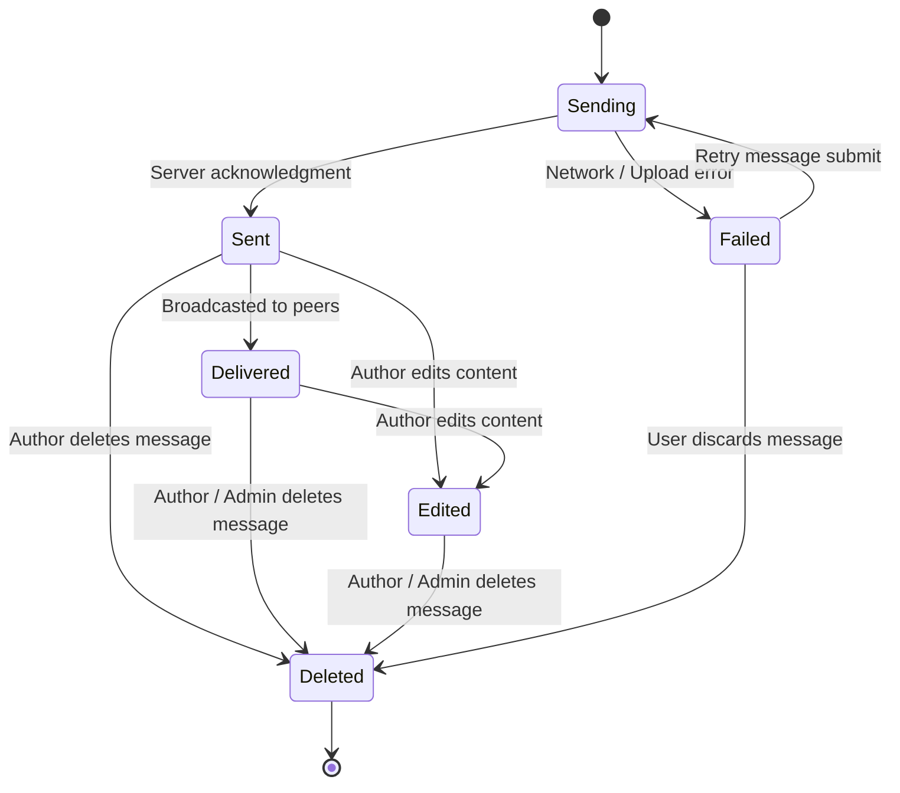
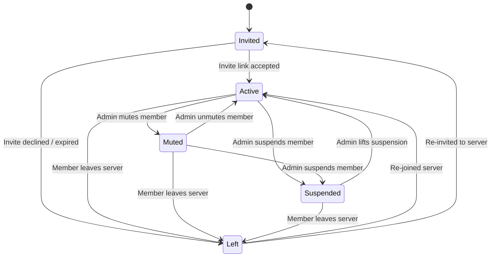

# Domain Entities State Machines

This document covers state machines for chat message lifecycles and server membership statuses.

---

## 1. Message Lifecycle State Machine (`MessageStatus`)

Tracks message states from optimistic client dispatch through editing, delivery, and deletion.



### Usage Example:

```php
use App\Enums\MessageStatus;

$message = Message::find($id);
$message->transitionStatusTo(MessageStatus::Delivered);
```

---

## 2. Server Member State Machine (`ServerMemberStatus`)

Tracks user membership statuses within a server pivot table (`server_user`).



### Usage Example:

```php
use App\Enums\ServerMemberStatus;

// Transition member pivot status
$server->users()->updateExistingPivot($userId, [
    'status' => ServerMemberStatus::Muted->value,
]);
```

---

## Technical Details

- **Message Model**: `App\Models\Message` (`$message->transitionStatusTo(...)`)
- **Server Pivot**: `server_user` (`status` column cast to `ServerMemberStatus`)
