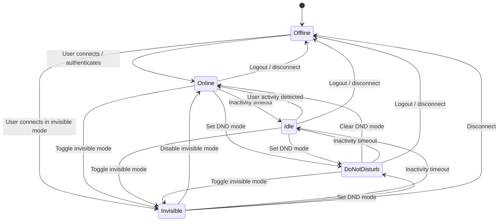

# User Presence State Machine

The **User Presence State Machine** manages the online presence and activity states of users across Oxy.

---

## State Transition Diagram



---

## Technical Details

- **Enum**: `App\Enums\UserStatus`
- **Database Table**: `users.status`
- **Model**: `App\Models\User`
- **Broadcast Event**: `App\Events\Users\UserStatusUpdated` (dispatched over `presence` channel)

### Execution Example:

```php
$user = User::find($id);

// Safely transition status
$user->transitionStatusTo(UserStatus::Online);
```
