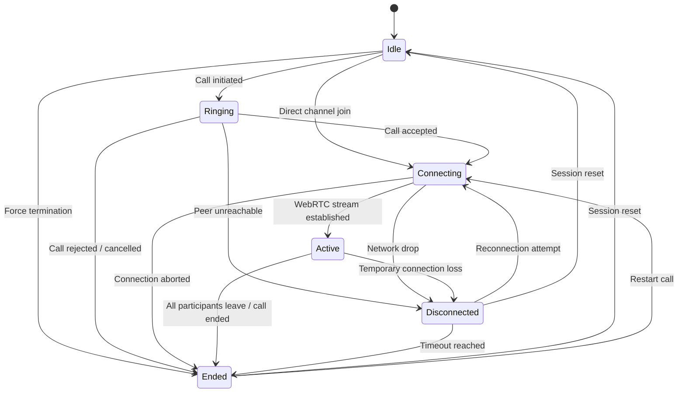
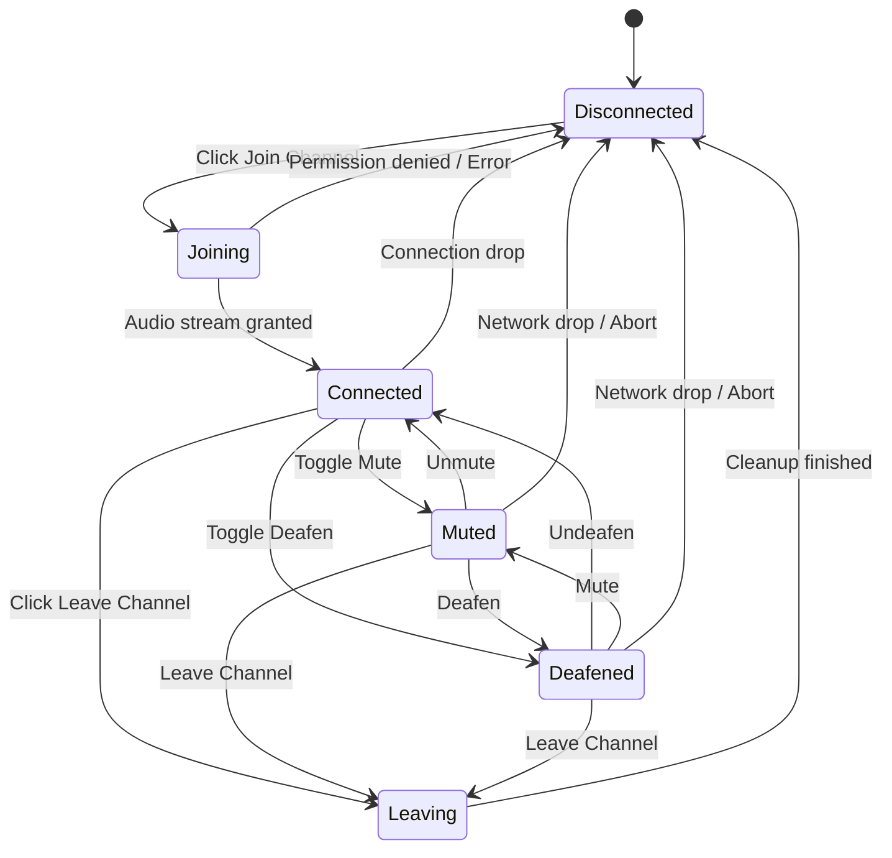

# Voice Call State Machine

The **Voice Call State Machine** governs voice channels, WebRTC call sessions, and client audio participant states.

---

## 1. Call Lifecycle State Machine (`VoiceCallStatus`)



---

## 2. Participant Audio State Machine (`VoiceParticipantState`)

Client-side participant state managed by `useVoiceCallStateMachine` composable (`resources/js/Pages/Voice/Speaking.vue`).



---

## Frontend Integration (`useVoiceCallStateMachine`)

```ts
import { useVoiceCallStateMachine } from '@/composables/useVoiceCallStateMachine';
import { VoiceParticipantState } from '@/types';

const voiceState = useVoiceCallStateMachine();

// Trigger transition
if (voiceState.transitionTo(VoiceParticipantState.Joining)) {
    // Setup MediaRecorder / WebRTC
}
```
