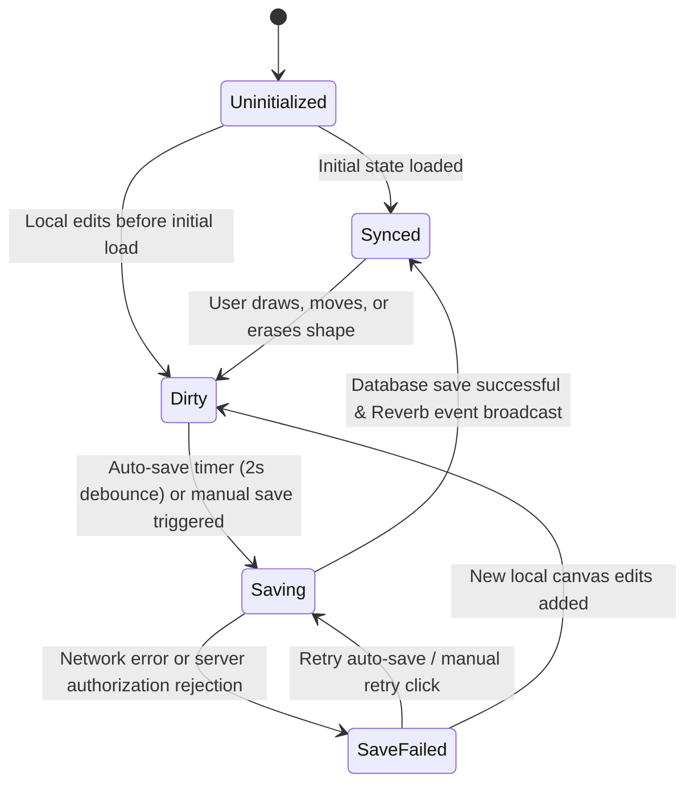

# Whiteboard Sync State Machine

The **Whiteboard Sync State Machine** manages canvas shape modifications, Yjs document synchronization, real-time Reverb event broadcasting, and persistent database storage.

---

## State Transition Diagram



---

## Technical Details

- **Enum**: `App\Enums\WhiteboardSyncState` (`uninitialized`, `synced`, `dirty`, `saving`, `save_failed`)
- **Database Column**: `whiteboards.sync_status`
- **Model**: `App\Models\Whiteboard`
- **Controller**: `App\Http\Controllers\WhiteboardController@saveState`
- **Broadcast Event**: `App\Events\Whiteboards\WhiteboardStateUpdated` (`private-whiteboards.{channelId}`)
- **Frontend Composable**: `useWhiteboardSyncStateMachine`
- **Frontend View**: `resources/js/Pages/Whiteboard/WhiteboardBoard.vue`

---

## Syncing & Real-Time Architecture

1. **Yjs CRDT Collaboration**:
   - `y-websocket` server runs on `:1234` for real-time shape syncing across active canvas sessions.
   - `Y.Map('shapes')` stores Konva shapes and provides undo/redo history (`Y.UndoManager`).

2. **Backend Persistence & State Machine**:
   - Canvas modifications trigger `markDirty()`, transitioning the state machine from `Synced` -> `Dirty`.
   - A debounced auto-save timer (2000ms) or user interaction initiates `saveState()`.
   - The frontend transitions `Dirty` -> `Saving` and sends a `POST /whiteboard/{id}/save` API request.
   - The backend validates server membership authorization, updates the `state` field, safely transitions `sync_status` to `Synced`, and dispatches `WhiteboardStateUpdated` via Laravel Reverb.
   - On HTTP 200 response, the frontend transitions `Saving` -> `Synced`. On failure, it transitions to `SaveFailed` and displays an interactive retry badge.

3. **SQLite WAL Mode Production Concurrency**:
   - SQLite is configured with `PRAGMA journal_mode=WAL;` and `PRAGMA synchronous=NORMAL;` in `AppServiceProvider` and container `start.sh`.
   - Ensures non-blocking concurrent writes between FrankenPHP/Octane application workers, background queue processes, and Reverb WebSocket listeners.

---

## Example Usage

### Backend Model Transition & Broadcast
```php
// Transition sync status and broadcast update
$whiteboard->transitionSyncStatusTo(WhiteboardSyncState::Saving);
$whiteboard->transitionSyncStatusTo(WhiteboardSyncState::Synced);

broadcast(new WhiteboardStateUpdated($whiteboard))->toOthers();
```

### Frontend Composable Usage
```ts
import { useWhiteboardSyncStateMachine } from '@/composables/useWhiteboardSyncStateMachine';
import { WhiteboardSyncState } from '@/types';

const syncSM = useWhiteboardSyncStateMachine(WhiteboardSyncState.Synced);

// Transition on edit
syncSM.transitionTo(WhiteboardSyncState.Dirty);

// Transition on save
if (syncSM.canTransitionTo(WhiteboardSyncState.Saving)) {
    syncSM.transitionTo(WhiteboardSyncState.Saving);
}
```
