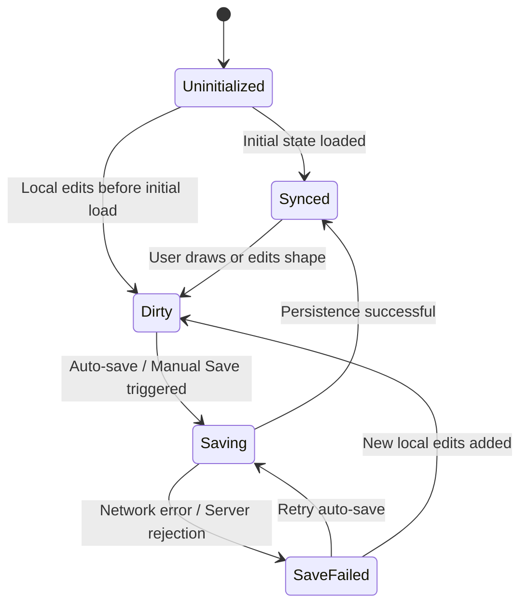

# Whiteboard Sync State Machine

The **Whiteboard Sync State Machine** manages canvas shape modifications, Yjs document synchronization, and database persistence.

---

## State Transition Diagram



---

## Technical Details

- **Enum**: `App\Enums\WhiteboardSyncState`
- **Database Table**: `whiteboards.sync_status`
- **Model**: `App\Models\Whiteboard`
- **Frontend Composable**: `useWhiteboardSyncStateMachine`

---

## Example Usage

```php
// Backend Model Transition
$whiteboard->transitionSyncStatusTo(WhiteboardSyncState::Dirty);
```

```ts
// Frontend Composable Transition
const syncSM = useWhiteboardSyncStateMachine();
syncSM.transitionTo(WhiteboardSyncState.Saving);
```
